# ♡ Retos de código UX ♡
1. Explica qué partes conforman el UX y qué partes el UI de la página de Laboratoria http://www.laboratoria.la/

UX es el diseño de interacción, el proceso de diseño de interacción se centra en las formas en que los usuarios interactúan con el producto.

UI es diseño visual, el proceso de diseño visual se centra en la apariencia y sensación del producto final.

Trabajo del UX:

  1. Analizar los objetivos principales de la página, en el caso de Laboratoria, tener postulantes (mujeres interesdas en pertenecer al mundo tech) y empresas interesadas en las egresadas y en el trabajo que se realiza en Laboratoria, pues forman parte importante de Laboratoria.

    1.1 Formularse preguntas clave que permitan obtener la información necesaria como:

     ¿Cuál es el principal objetivo de la página web?

    ¿Quén es el público meta? (Arquetipo de usuario)
    ¿Cuál es su edad? ¿Qué intereses tiene?, etc.

    ¿Cuáles son los datos que necesitavsaber? ¿Que información debo proporcionarle en la página de inicio?

    1.2 Encuestar a los posibles usuarios para saber qué es lo que les interesaría saber o qué es lo que buscan en la página, de qué forma navegarían en ella, etc.

  2. Con la información obtenida generar un diagrama que explique la Arquitectura de la información, para tener más claro cómo será la estructura de la landing page.
  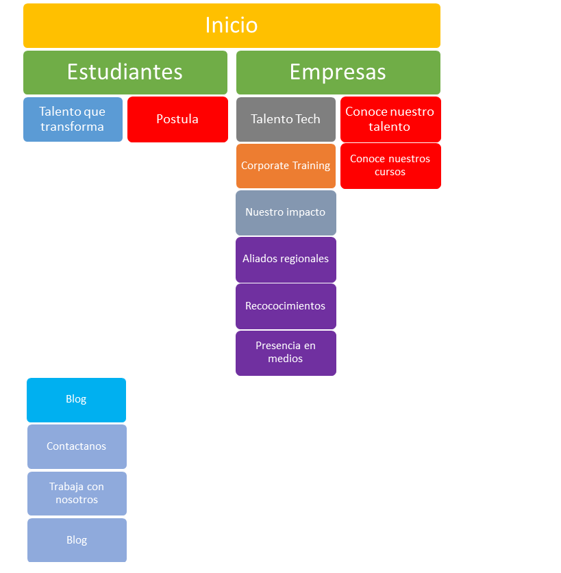     

  3. Hacer un sketch de la landing page 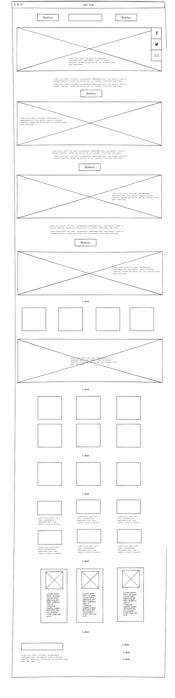
  que sirva para poder hacer un wireframe, para que el UI siga el proceso de diseño.

  4. El UI selecciona los colores, las tipografías y los íconos y logotipos que irán en cada página.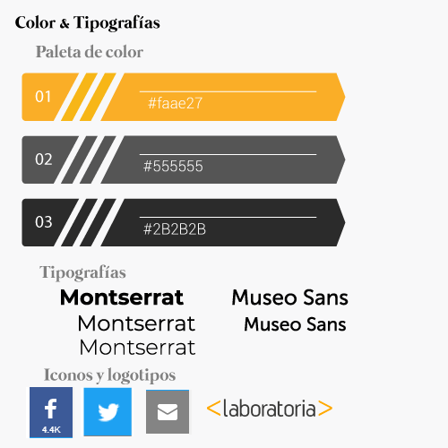 Una vez seleccionado todo hace un mockup de las páginas para que el UX haga las rutas de usuario.

  5. Con las rutas de usuario se elabora un prototype, que guiará al Front end Developer en la elaboración de la página, pues contiene una vista de cada página y de cada acción.

Identifica los elementos de navegación en los siguientes sites https://github.com/

1.
   Global

 Es la navegación principal del site. Normalmente es persistente y nos ayuda a explorar todas las opciones del site.
 En este caso nos muestra opciones como pricing (los planes de pago de github), Features, Business, Explore, Marketplace, que nos llevan a conocer qué mas ofrece el sitio.

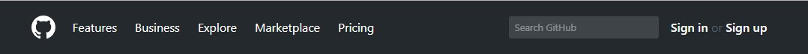

2.
   Global

 Es la navegación principal del site. Normalmente es persistente y nos ayuda a explorar todas las opciones del site.
 Nos muestra las opciones que conforman el mapa del sitio, como colabordores, recursos, etc.
 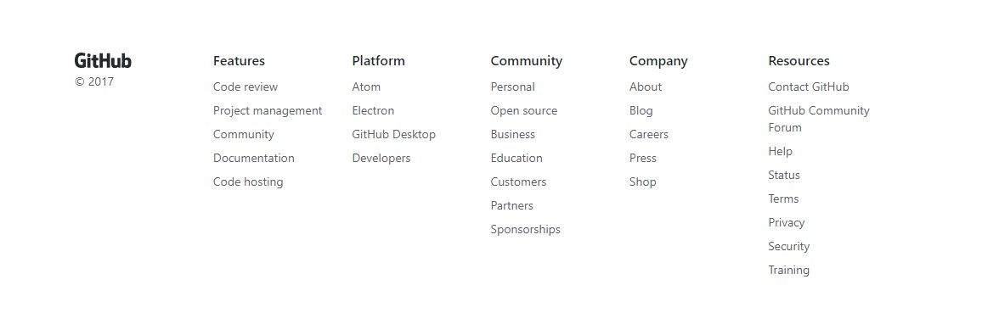3.
   Suplementaria

Es la navegación adicional, utilizada para señalar algunas funciones a los usuarios.
Como las opciones de nuestro perfil, crear un nuevo repositorio.

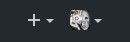

4.Contextual

Es la navegación acorde al contexto en el que está navegando el usuario. Se usa principalmente para recomendaciones.
Nos muestra la actividad resiente de las personas que seguimos.

5.Contextual

Es la navegación acorde al contexto en el que está navegando el usuario. Se usa principalmente para recomendaciones.
Nos muestra recomendaciones en base a quienes seguimos y nuestros repositorios.

En línea (inline)

Son links de referencia.
Como Explore, JavaScript, un link, etc.

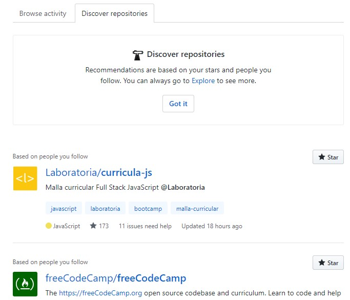

6.Facetada

Es la navegación a través de filtros no editables, definidos previamente por el sistema.
En este caso nuestros repositorios, con filtros definidos para buscar en ellos sin tener que ingresar a nuestro perfil.

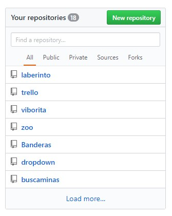

7.En línea (inline)

Son links de referencia.
Como Follow and watch.

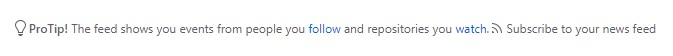

8.Local

Es la navegación “localizada” a una página o vista. En algunos casos, algunas páginas internas tienen su propia navegación que ayuda al usuario a explorar esa vista en particular. Como nuestro perfil, con nuestra información, a quién seguimos, quién nos sigue, etc.

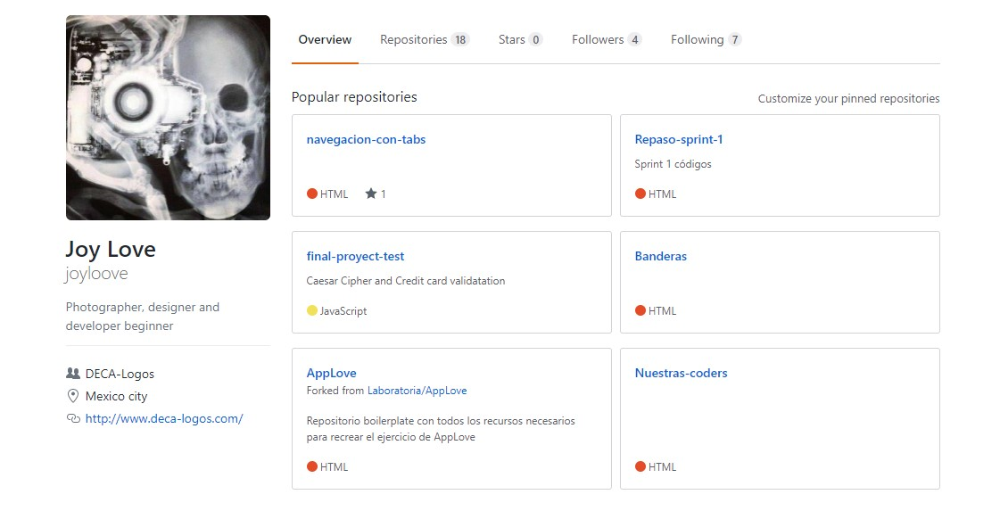

 Crea un sketch para la herramienta del dashboard de Laboratoria

El dashboard es una herramienta utilizada por profesores, training managers, directores y gerentes de Laboratoria para ver rápidamente qué está pasando en el salón de clases de Laboratoria. En el dashboard, los usuarios mencionados pueden ver rápidamente estadísticas y datos en tiempo real como:

    Número de alumnas inscritas
    Número de alumnas que desertaron
    Número y % de alumnas que pasan el criterio mínimo de evaluación
    Promedio de notas por sprint
    Promedio de notas HSE
    Promedio de notas técnicas
Además, dado que Laboratoria tiene muchas generaciones, regularmente 2 generaciones por año (estas generaciones empezaron en el 2014), y que opera en 4 sedes (Arequipa, Ciudad de México, Lima y Santiago de Chile), es posible que los usuarios quieran ver datos de sedes / generaciones anteriores para poder hacer comparaciones.

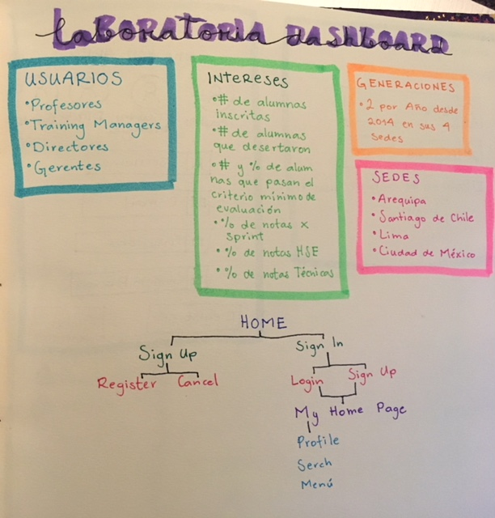

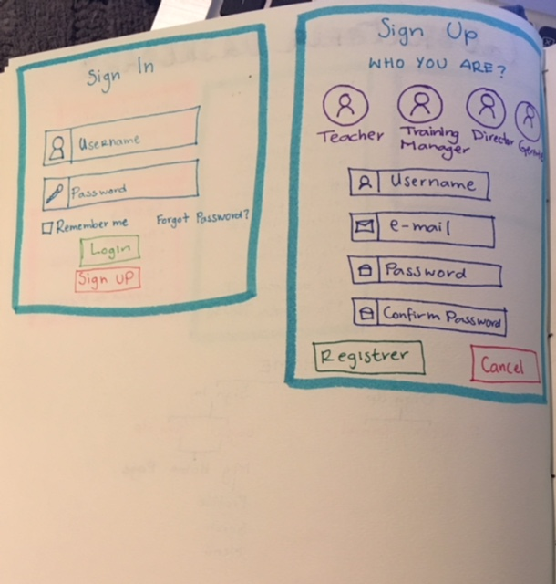

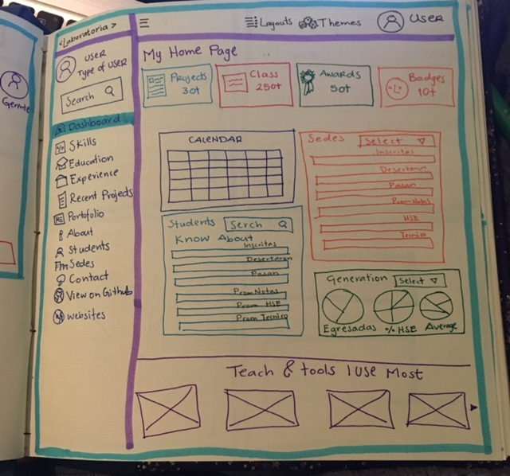

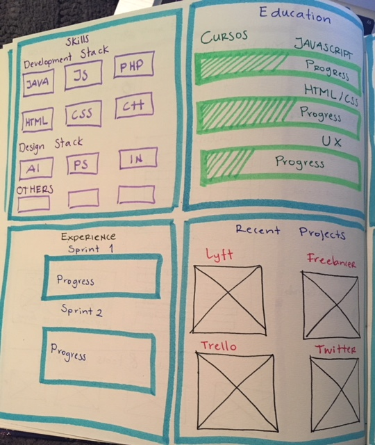

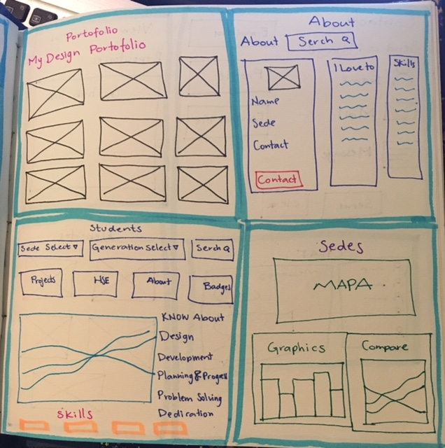

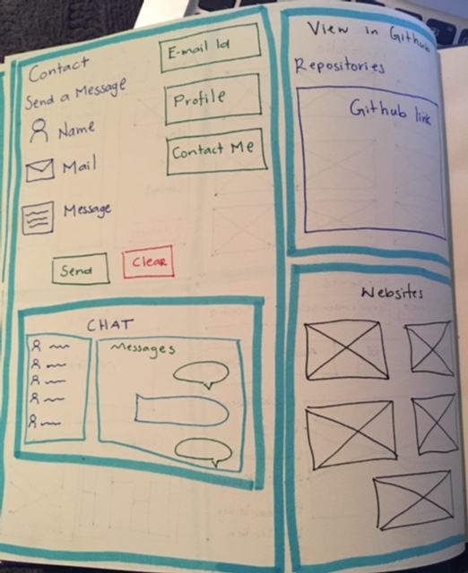
